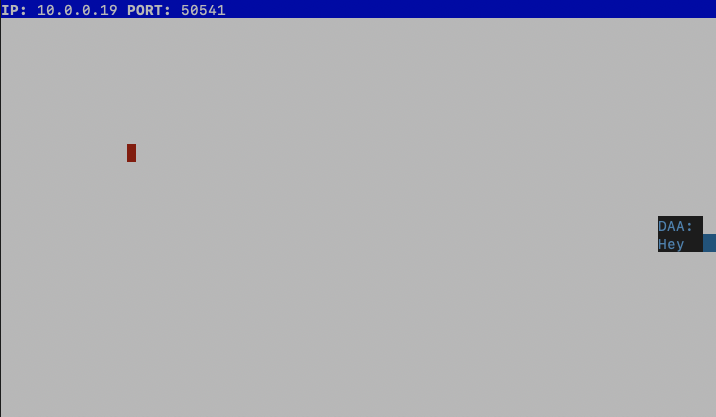

# Snake Client Project

Snake game is a very popular video game. It is a video game concept where the player maneuvers a dot and grows it by ‘eating’ pieces of food. As it moves and eats, it grows and the growing snake becomes an obstacle to smooth maneuvers. The goal is to grow it to become as big as possible without bumping into the side walls, or bumping into itself, upon which it dies.

This is simply a multiplayer take on the genre.

Before you can run this client, you will need to be running the server side which you can download and install from here. 

## Keyboard Shortcuts

### Moving

`w`: Moving Up \
`a`: Moving Left \
`s`: Moving Down \
`d`: Moving Right

### Sending Messages

`u`: "What's up?", \
`i`: "I'm winning.", \
`o`: "You are winning." 

## Getting Started

1. Clone and follow the server instructions within the [snek-multiplayer](https://github.com/lighthouse-labs/snek-multiplayer) repo
2. Run the game using the `node play.js` command

